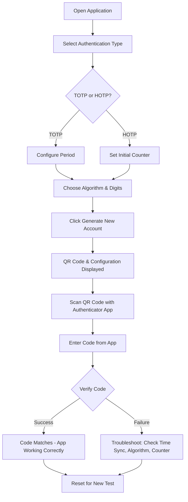
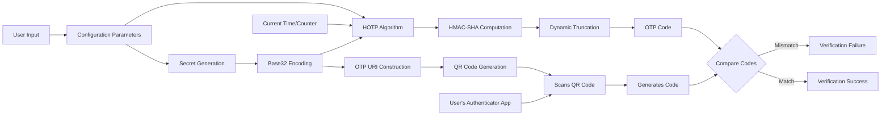

# 🔐 xsukax Authenticator App Tester

A powerful, privacy-focused web-based tool for generating and testing TOTP (Time-based One-Time Password) and HOTP (Hash-based One-Time Password) codes. Designed for developers, security professionals, and anyone who needs to test authenticator app implementations without compromising their sensitive credentials.

## 📋 Project Overview

The xsukax Authenticator App Tester is a comprehensive testing utility that enables users to generate cryptographically secure OTP secrets, create scannable QR codes, and verify authenticator app functionality in real-time. This tool supports industry-standard authentication protocols and algorithms, making it ideal for testing integrations with popular authenticator applications such as Google Authenticator, Microsoft Authenticator, Authy, and other RFC 6238/4226 compliant apps.

The application runs entirely in the browser, requiring no backend infrastructure or server-side processing, which ensures maximum privacy and security for testing scenarios.

## 🔒 Security and Privacy Benefits

### Client-Side Processing
All cryptographic operations, secret generation, and code verification occur exclusively within your browser. No data is transmitted to external servers, eliminating the risk of credential interception or unauthorized access to sensitive testing data.

### No Data Persistence
The application does not store, log, or persist any generated secrets, QR codes, or authentication configurations. All test data exists only in memory during the active session and is completely cleared upon page refresh or browser closure.

### Zero External Dependencies for Core Functionality
While the application leverages trusted CDN-hosted libraries (jsSHA for cryptographic operations and QRCode.js for QR generation), all authentication logic executes locally. Users can optionally download and self-host these libraries for completely air-gapped testing environments.

### Standards-Compliant Cryptography
Implements RFC 6238 (TOTP) and RFC 4226 (HOTP) specifications with support for SHA-1, SHA-256, and SHA-512 algorithms, ensuring compatibility with industry-standard authenticator implementations while maintaining cryptographic integrity.

### Transparent Source Code
As an open-source project, the entire codebase is available for security auditing, allowing security-conscious users to verify that no malicious code or hidden data collection mechanisms are present.

## ✨ Features and Advantages

- **Dual Authentication Protocol Support**: Seamlessly switch between TOTP (time-based) and HOTP (counter-based) authentication methods
- **Multiple Cryptographic Algorithms**: Choose from SHA-1, SHA-256, or SHA-512 hashing algorithms to match your security requirements
- **Flexible Code Length**: Generate 6-digit or 8-digit OTP codes to accommodate various authenticator app configurations
- **Configurable Time Period**: Adjust TOTP time step duration (default 30 seconds) for specialized testing scenarios
- **QR Code Generation**: Instantly create scannable QR codes compatible with all major authenticator applications
- **Real-Time Code Verification**: Test authenticator app functionality by verifying generated codes with clock skew tolerance
- **Counter Management**: For HOTP testing, easily increment and synchronize counter values
- **Random Test Data Generation**: Automatically generates random service names, email addresses, and secrets for rapid testing
- **Copy-to-Clipboard Functionality**: Quickly copy secrets, URIs, and configuration parameters for integration testing
- **Clock Skew Tolerance**: TOTP verification accepts codes from previous and next time windows to simulate real-world synchronization scenarios
- **Responsive Design**: Fully functional across desktop, tablet, and mobile devices
- **No Installation Required**: Single HTML file deployment - simply open in any modern web browser

## 🚀 Installation Instructions

### Method 1: Direct Download
1. Download the `index.html` file from the [GitHub repository](https://github.com/xsukax/xsukax-Authenticator-App-Tester)
2. Save the file to your local machine
3. Open `index.html` directly in any modern web browser (Chrome, Firefox, Safari, Edge)

### Method 2: Clone Repository
```bash
# Clone the repository
git clone https://github.com/xsukax/xsukax-Authenticator-App-Tester.git

# Navigate to the directory
cd xsukax-Authenticator-App-Tester

# Open the application
# On macOS:
open index.html

# On Linux:
xdg-open index.html

# On Windows:
start index.html
```

### Method 3: Web Server Deployment
For production or team environments:

```bash
# Using Python's built-in HTTP server
python3 -m http.server 8000

# Using Node.js http-server (install globally: npm install -g http-server)
http-server -p 8000

# Access at http://localhost:8000
```

### System Requirements
- Modern web browser with JavaScript enabled
- Internet connection for CDN resources (jsSHA, QRCode.js libraries)
- No additional software or dependencies required

## 📖 Usage Guide

### Basic Workflow



### Step-by-Step Instructions

#### 1. Configure Authentication Parameters

**Select Authentication Type:**
- **TOTP (Time-based)**: For apps that generate codes based on current time (most common)
- **HOTP (Counter-based)**: For apps that generate codes based on an incrementing counter

**Choose Algorithm:**
- **SHA-1**: Most widely supported, default for most authenticator apps
- **SHA-256**: Enhanced security, supported by modern authenticator apps
- **SHA-512**: Maximum security, limited app support

**Set Code Length:**
- **6 digits**: Industry standard, universally supported
- **8 digits**: Enhanced security, supported by most modern apps

**Configure Time/Counter Parameters:**
- **TOTP Period**: Time step in seconds (default 30, standard is 30)
- **HOTP Counter**: Starting counter value (usually 0)

#### 2. Generate Test Account

Click the **"Generate New Account"** button. The application will:
- Generate a cryptographically secure random secret (Base32 encoded)
- Create a random service name and email address for testing
- Generate a QR code containing the OTP authentication URI
- Display all configuration parameters

#### 3. Scan QR Code

1. Open your authenticator app (Google Authenticator, Microsoft Authenticator, Authy, etc.)
2. Select "Add Account" or "Scan QR Code"
3. Point your device camera at the generated QR code
4. Verify the account appears in your authenticator app with the correct service name

#### 4. Verify Code Generation

1. Wait for your authenticator app to generate a code
2. Enter the displayed code in the "Enter Code from Your Authenticator App" field
3. Click **"Verify Code"** button
4. The application will validate the code and display success or error messages

**TOTP Verification**: The tool checks the current time window plus adjacent windows (±1 period) to account for clock skew.

**HOTP Verification**: Ensure your counter value matches the displayed counter. Use the **"Increment Counter"** button to synchronize if needed.

### Architecture Overview



### Advanced Features

#### Copy Configuration Data
Click the "Copy" button next to any configuration field to copy:
- Service name (issuer)
- Account email
- Authentication type
- Algorithm
- Secret key
- Complete OTP URI

#### Manual URI Usage
Copy the displayed URI for manual entry in authenticator apps that support text-based configuration:
```
otpauth://totp/ServiceName:user@example.com?secret=ABCD...&issuer=ServiceName&algorithm=SHA-1&digits=6&period=30
```

#### HOTP Counter Management
For HOTP testing:
1. Verify initial code with counter = 0
2. Click "Increment Counter" after each successful verification
3. Ensure your authenticator app counter stays synchronized
4. Note: HOTP apps may not auto-increment; manual synchronization may be required

### Troubleshooting

**Verification Fails for TOTP:**
- Ensure device time is accurate and synchronized with NTP servers
- Check that the correct algorithm (SHA-1, SHA-256, SHA-512) is supported by your app
- Verify the period setting (default 30 seconds)
- Most apps only support SHA-1; try switching to SHA-1 if verification fails

**Verification Fails for HOTP:**
- Confirm counter values match between the tool and authenticator app
- Some authenticator apps may not support HOTP
- Ensure the algorithm is supported (SHA-1 most compatible)

**QR Code Won't Scan:**
- Increase screen brightness
- Ensure good lighting conditions
- Try zooming the QR code (browser zoom)
- Manually enter the secret if QR scanning fails

## 📄 License

This project is licensed under the GNU General Public License v3.0.

## 🤝 Contributing

Contributions are welcome! Please feel free to submit pull requests, report bugs, or suggest new features through the [GitHub Issues](https://github.com/xsukax/xsukax-Authenticator-App-Tester/issues) page.

## 🔗 Useful Resources

- [RFC 6238 - TOTP Specification](https://tools.ietf.org/html/rfc6238)
- [RFC 4226 - HOTP Specification](https://tools.ietf.org/html/rfc4226)
- [Google Authenticator](https://support.google.com/accounts/answer/1066447)
- [Microsoft Authenticator](https://www.microsoft.com/en-us/security/mobile-authenticator-app)

## ⚠️ Disclaimer

This tool is designed for testing and development purposes. Do not use production secrets or credentials with this application. Always generate new, random secrets for testing purposes and never reuse secrets from actual production systems.

---

**Repository**: https://github.com/xsukax/xsukax-Authenticator-App-Tester

**Issues & Support**: https://github.com/xsukax/xsukax-Authenticator-App-Tester/issues
